DistributeLib
=============

A single-source-file library for converting 32-bit integer inputs into various 1D, 2D, and 
3D distributions and types. The intended use is to convert the output of an RNG into various 
more useful forms.

Features:

* Generation of int, float, 2D and 3D samples over various shapes
* Cheap routines that only take one input number, but may be less accurate or controllable
* More accurate routines that take a full number of input samples, e.g., three for a cube
* Pre-modulation of inputs into triangular, gaussian-like, and weighted forms
* Gaussian (normal) distribution as both a cheap approximation and via full Box-Muller transform

To build and run the test app:

    c++ --std=c++11 Distribute.cpp DistributeTest.cpp -o distribute && ./distribute 200

Examples
--------

Assuming 'rng' returns the next sample via operator uint32_t(), usage can be as simple as 
below, otherwise substitute rng() or rng.next() or whatever else is appropriate.

1D:

	float score     = ToFloat(rng, 1.0f, 100.0f);
	int   modifier  = ToInt32Signed(rng, 5);
	int   dayOfYear = ToInt32Inclusive(rng, 1, 365);
	float weightKG  = ToFloat(ToGaussLike(rng), 50.0f, 130.0f);

2D/3D:

	Vec2f circleLoc     = ToCircle(rng);
	Vec2f pixTentSample = ToSquare(ModTriangle(rng), ModTriangle(rng));
	Vec3f rayDir        = ToDirection3(rng);

Warning: do not simply use rand() to feed these functions, as, in addition to its low 
quality, its range is not guaranteed to be a full 32 bits. Consider a simple LCG or 
something like http://www.pcg-random.org instead.

Output
------

* 1D: float [-1, 1], integer [-10, 10], with a simple LCG input.

	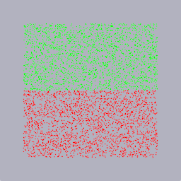
	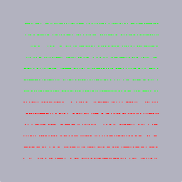

* 2D: square, ring, triangle

	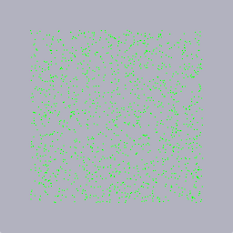
	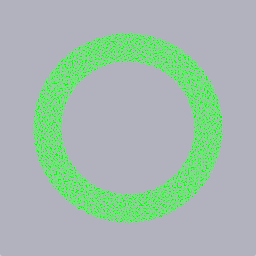
	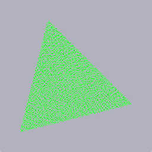

* Triangle Modifier: integer, float, square in both dimensions

	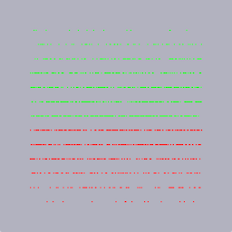
	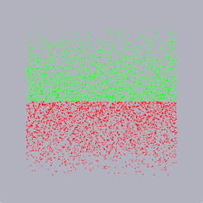
	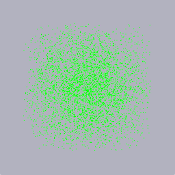

* Gauss-like Modifier: integer, square, and full gaussian for comparison. (Note long tail.)

	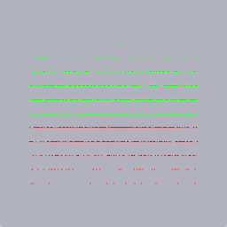
	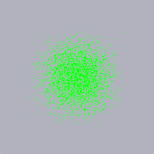
	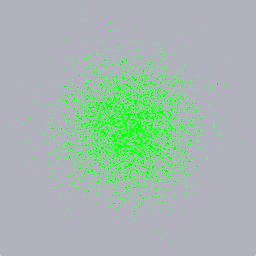

* Weighted Modifier: float and circle weighted by [1, 8, 0, 4, 1]

	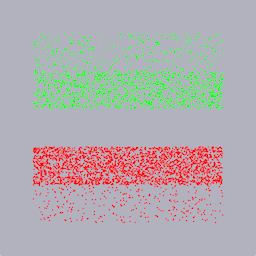
	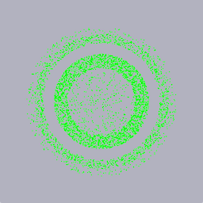

* Non-random inputs: Halton 100, 1000, 5000 samples

	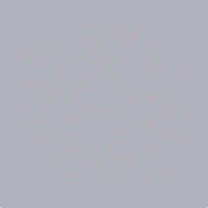
	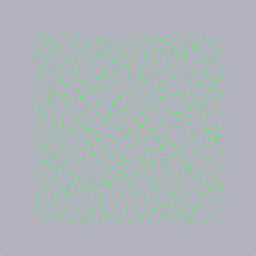
	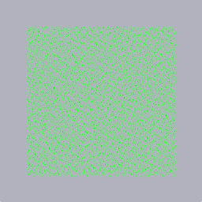

* Non-random inputs: Golden ratio square, circle, and sphere surface

	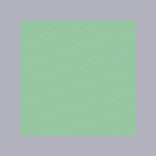
	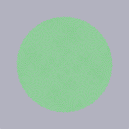
	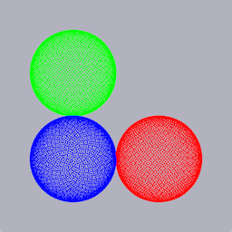
